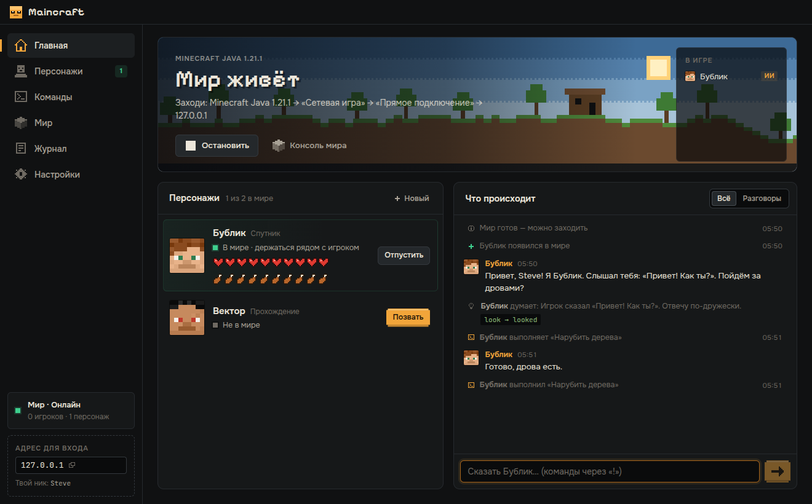

# Maincraft — приложение для ПК

Maincraft ставит на компьютер сервер Minecraft и поселяет в нём ИИ-персонажей со своим характером.
С ними можно разговаривать в чате (и слышать их голос), давать поручения, придумывать свои команды —
или смотреть, как персонаж-«прохожденец» с нуля идёт к Эндер-дракону.



## Для игроков

### Установка

1. Скачай `Maincraft-Setup-x.y.z.exe` со страницы
   [Releases](https://github.com/frtertaer/maincraft/releases) (или из артефактов последней сборки
   в разделе **Actions → Desktop app**).
2. Запусти файл. Установка идёт в один клик, права администратора не нужны.
   Windows может показать окно SmartScreen, потому что установщик пока не подписан сертификатом:
   **Подробнее → Выполнить в любом случае**.
3. При первом запуске мастер спросит:
   - твой ник в Minecraft — по нему персонажи тебя узнают;
   - какой ИИ будет думать за персонажей: ключ Anthropic, совместимый сервис или локальная модель
     (Ollama / LM Studio). Кнопка «Проверить связь» сразу покажет, работает ли ключ;
   - согласие с [EULA Minecraft](https://aka.ms/MinecraftEULA). После этого приложение само скачает
     Java 21 и сервер Paper (около 100 МБ) и проверит их контрольные суммы;
   - кого поселить в мире: весёлый спутник Бублик, «прохожденец» Вектор, садовница Ива,
     ворчливый шахтёр Дед Кирка — или все сразу.
4. Нажми «Запустить мир», затем в Minecraft Java 1.21.1: **Сетевая игра → Прямое подключение →
   `127.0.0.1`**.

Java, Python, Node.js и прочее ставить не нужно — всё уже внутри.

### Что умеет

| Раздел | Что там |
|---|---|
| **Главная** | Пейзаж мира (день и ночь совпадают со временем в игре), персонажи со здоровьем и сытостью, живая лента: чат, реплики, мысли ИИ, события. Можно написать персонажу прямо из приложения. |
| **Персонажи** | Облик (пиксельное лицо), роль, характер (5 шкал), биография, манера речи, любимая и нелюбимая еда, страхи, цель, самостоятельность, поведение в бою, голос с прослушиванием. Изменения применяются к персонажу в мире без перезапуска. «Глазами персонажа» — 3D-вид от его лица. |
| **Команды** | Свои команды: фразы вызова (`!дрова 16`, «Бублик, охраняй»), «Задание для ИИ» словами или «Сценарий» из готовых действий (добыть, скрафтить, подойти, поставить блок…) с подстановками `{player}`, `{args}`, `{px} {py} {pz}`. |
| **Мир** | Консоль сервера, быстрые команды, сложность, режим, память, резервные копии, новый мир. |
| **Журнал** | Технические записи сервера и каждого персонажа. |
| **Настройки** | Ник, ИИ-провайдер и ключ (хранится зашифрованным средствами ОС), лимиты расхода токенов, звук. |

Вкусы — не только слова в промпте: персонаж действительно сначала ест любимую еду и отказывается
от нелюбимой, пока не проголодается всерьёз. Смелость влияет на то, когда он убегает из боя.

### Безопасность

- Сервер и просмотр «глазами персонажа» слушают только `127.0.0.1` — из интернета их не видно.
- Сервер работает в offline-режиме (иначе боты не смогут войти), поэтому не открывай порт наружу.
- Ключ ИИ шифруется средствами Windows (DPAPI) и никуда, кроме выбранного сервиса ИИ, не отправляется.
- Лимиты в настройках защищают от неожиданного счёта: упёршись в лимит, персонаж засыпает.

## Для разработчиков

```bash
cd agent && npm ci          # бот (Mineflayer + LLM), используется приложением
cd ../app && npm ci
npm run dev                 # приложение с горячей перезагрузкой
npm test                    # unit-тесты (включая проверку конфигов, которые приложение отдаёт агенту)
npm run typecheck
npm run dist:win            # установщик Windows (собирать на Windows; в CI это делает Actions)
```

### Как устроено

```
app/
  src/main/            процесс Electron: всё, что трогает диск, сеть и процессы
    services/runtime   скачивание Java (Adoptium) и Paper (PaperMC Fill API) с проверкой SHA-256
    services/server    запуск Paper, разбор лога (готовность, входы, чат, смерти), консоль
    services/bots      по процессу агента на персонажа, IPC-мост, живое переконфигурирование
    services/agentConfig  карточка персонажа → agent/config.json
    services/tts       голос через Microsoft Edge Read Aloud (без Python)
    services/aiTest    проверка ключа одним маленьким запросом
    sanitize.ts        валидация всего, что приходит из интерфейса
  src/preload/         безопасный мост window.maincraft (contextIsolation + sandbox)
  src/shared/          типы, каталог действий/еды/голосов, шаблоны, сборка промпта персонажа
  src/renderer/        интерфейс на React: страницы, дизайн-система, пиксельные иконки
  scripts/             иконка, сборка облегчённого бандла агента, afterPack для electron-builder
agent/                 сам бот; при запуске из приложения получает события через process.send
```

Агент запускается встроенным в Electron Node.js (`ELECTRON_RUN_AS_NODE`), поэтому пользователю не
нужен свой Node. Данные приложения лежат в `%APPDATA%\Maincraft` (сервер, миры, персонажи, журналы);
для тестов папку можно переопределить переменной `MAINCRAFT_HOME`.

### Как расширять

- **Новое действие для сценариев** — добавь его в `agent/src/actions.js` (`executeAction`),
  в `SCRIPT_STEP_TYPES` в `agent/src/config.js` и описание с параметрами в `ACTIONS`
  в `src/shared/catalog.ts` — редактор команд подхватит его сам.
- **Новое поле персонажа** — тип в `src/shared/types.ts`, значение по умолчанию в `defaults.ts`,
  проверка в `src/main/sanitize.ts`, влияние на промпт в `persona.ts` или на поведение
  в `agentConfig.ts`, поле в редакторе `pages/Characters.tsx`.
- **Событие из игры в интерфейс** — `bridge.emit(...)` в агенте → обработчик в `services/bots.ts`
  → `send(...)` в `main/index.ts` → подписка `api.on(...)` в интерфейсе.
- **Новая страница** — компонент в `src/renderer/src/pages`, пункт в `NAV` в `App.tsx`.

Дизайн: тёмный «сланец», тёплый янтарный акцент «факела», шрифты Onest / Pixelify Sans /
JetBrains Mono, собственные пиксельные иконки 10×10 (`components/Icon.tsx`), пиксельные лица
персонажей и пейзаж (`components/Pixel.tsx`). Новые экраны стоит собирать из компонентов
`components/ui.tsx`, чтобы всё выглядело одинаково.

### Дальше по плану

- голосовой ввод (push-to-talk → распознавание речи → персонаж отвечает голосом);
- интеграция детерминированного прохождения (`clear-run`) как отдельного режима с прогрессом по этапам;
- несколько миров и выбор версии Minecraft;
- скины персонажей в игре;
- подпись установщика, чтобы Windows не показывала SmartScreen.
